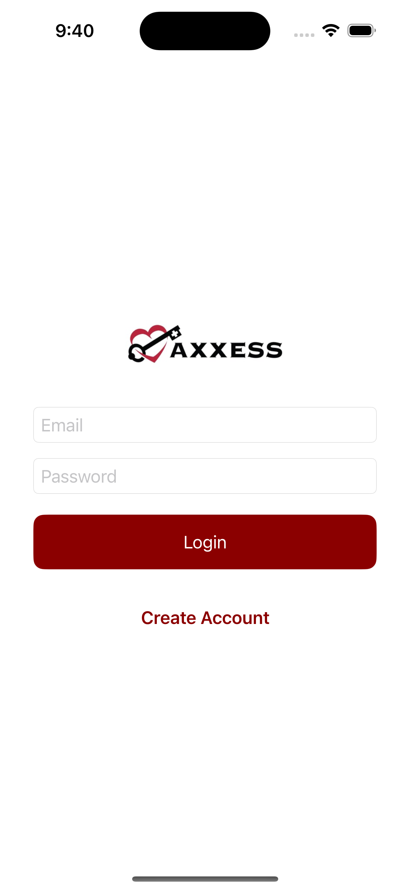
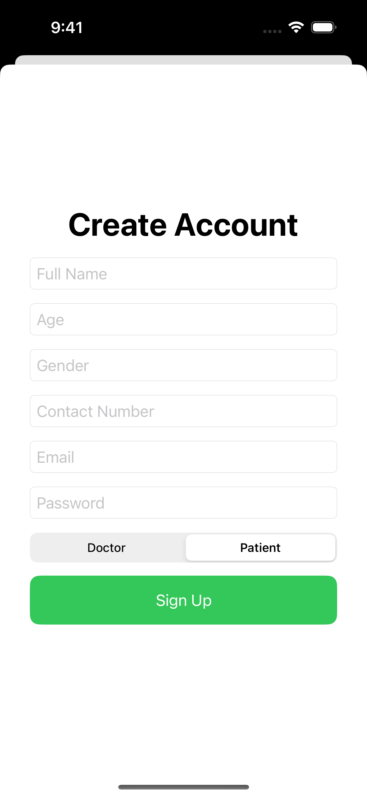
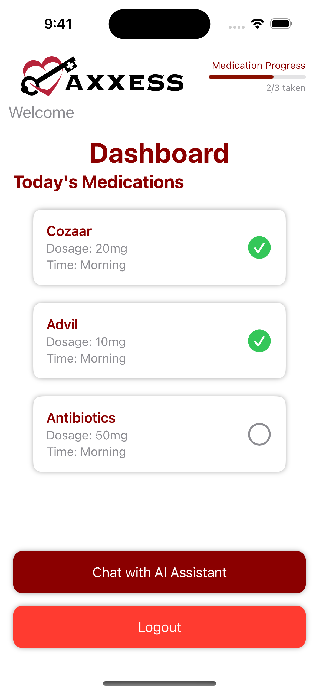
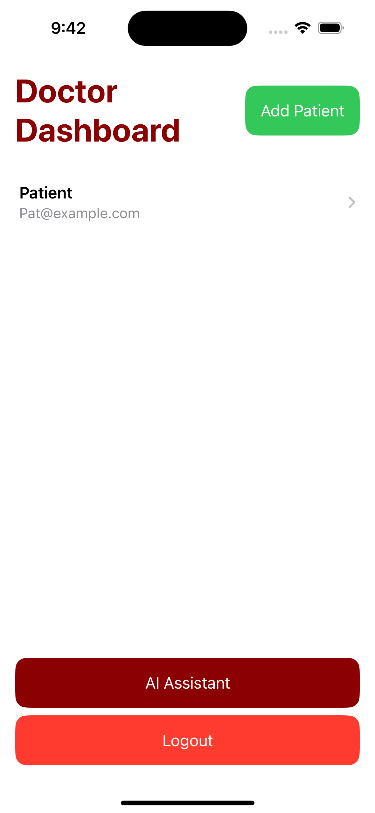
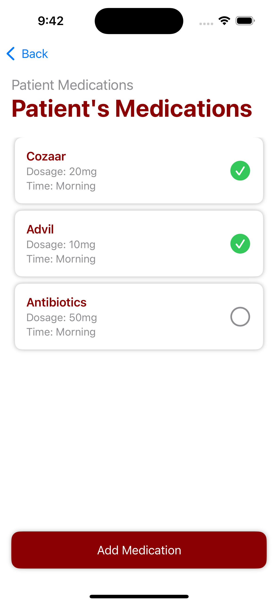
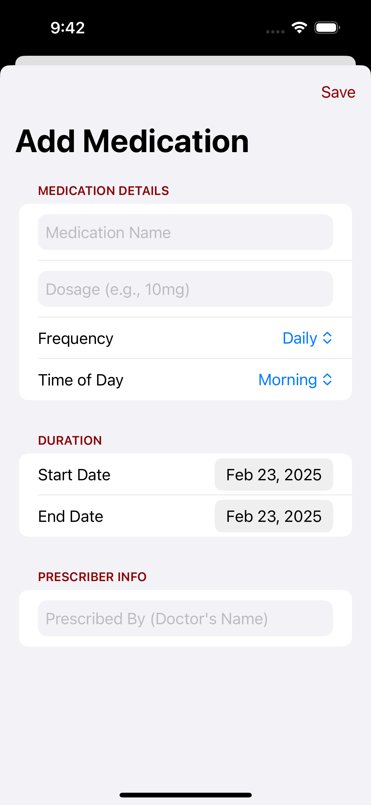
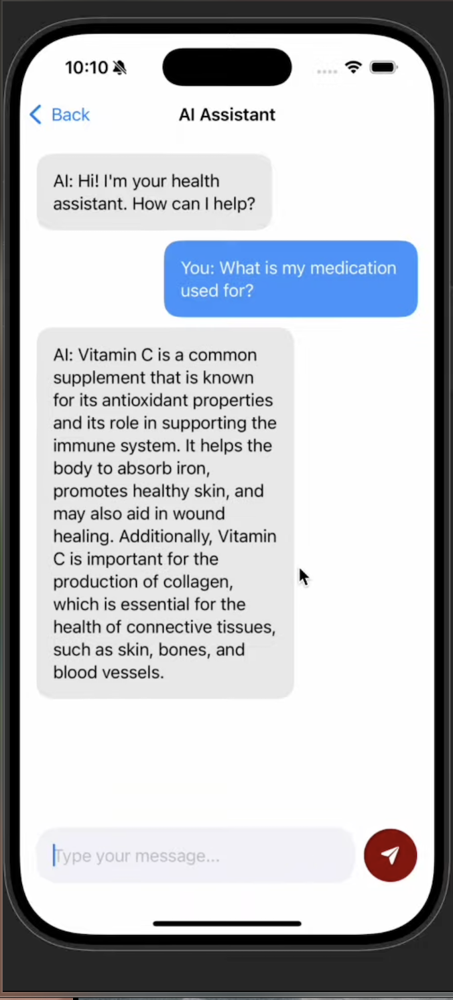

# AxxessCare
AxxessCare is an innovative iOS home healthcare app designed for the Axxess Hackathon. It enhances patient engagement in home healthcare by bridging communication between patients and doctors through technology-driven solutions.

## 📺 Youtube Demo

https://www.youtube.com/watch?v=uMAwtleVWk8

## 📸 Screenshots

<table>
  <tr>
    <th>Login page</th>
    <th>Account Creation</th>
  </tr>
  <tr>
    <td></td>
    <td></td>
  </tr>
  <tr>
    <th>Patient Dashboard</th>
    <th>Doctor Dashboard</th>
  </tr>
  <tr>
    <td></td>
    <td></td>
  </tr>
  <tr>
    <th>Doctor View of Patient</th>
    <th>Add Medication</th>
  </tr>
  <tr>
    <td></td>
    <td></td>
  </tr>
  <tr>
    <th>AI Chat</th>
  </tr>
  <tr>
    <td></td>
  </tr>
</table>


## 🚀 Features
Patient and Doctor Roles: Tailored dashboards for both doctors and patients.

AI Assistant: Patients can ask about medications
Doctors can ask about patients , medications, and treatment details via the AI.

Medication Tracking: Patients can log medications and view daily progress.

Secure Authentication: Integrated with Firebase for secure login.

Firestore Integration: Real-time data synchronization for users, patients, and medications.

## 🛠️ Tech Stack
Languages: Swift, SwiftUI
Backend & Database: Firebase Firestore
Authentication: Firebase Auth
APIs: OpenAI GPT-3.5 for AI Assistant
Other Tools:
Firebase Storage 
GoogleService-Info.plist for Firebase configuration

## 📲 Installation & Setup

### 1️⃣ Clone the Repository and open in Xcode

```bash
git clone https://github.com/joshuafitzerald/axxesscare.git
cd axxesscare
```

Open axxesscare.xcodeproj with Xcode

### 2️⃣ Firebase Setup
Download GoogleService-Info.plist from the Firebase Console.
Add the file to your project in Xcode

### 3️⃣ OpenAI setup(optional)

Delete Info.plist.example 

Create a new file called Info.plist in your root folder (Same folder where AxxessHealthAppApp.swift is)

Set the key to OpenAI_API_KEY make sure the dictionary type is string. Then change the value to your OpenAI API key. you can do so at this link https://platform.openai.com/docs/overview

#### COMMON ERROR: 
How to Fix the "Multiple commands produce 'Info.plist'" Error:
1. Check Build Phases for Duplicate Info.plist Entries:
Go to your project settings:

Click on the healthapp project in the Xcode Navigator.
Select the healthapp target.
Go to Build Phases.
Check the "Copy Bundle Resources" section:

Ensure Info.plist is NOT listed here.
If it is, remove it

### 4️⃣ Build & Run the App
In Xcode, select a simulator (e.g., iPhone 16).
Press Command + K to clean.
Press Command + R to build and run.

### 🎉 Accomplishments
Successfully integrated AI-powered doctor-patient communication.
Created a user-friendly interface for patients and doctors.
Overcame challenges with OpenAI API integration and Firestore data structuring.

### 📖 Lessons Learned
Gained deep insights into SwiftUI and Firebase integration.
Understood best practices for securely managing API keys.
Improved problem-solving through debugging complex API interactions.
